# Dokumentasi Teknis — Portal Berita Klojen.com

## Daftar Isi

1. [Gambaran Umum Sistem](#1-gambaran-umum-sistem)
2. [Use Case Diagram](#2-use-case-diagram)
3. [Activity Diagram](#3-activity-diagram)
4. [Sequence Diagram](#4-sequence-diagram)
5. [Class Diagram](#5-class-diagram)
6. [Conceptual Data Model (CDM)](#6-conceptual-data-model-cdm)
7. [Physical Data Model (PDM)](#7-physical-data-model-pdm)
8. [Penjelasan Detail](#8-penjelasan-detail)

---

## 1. Gambaran Umum Sistem

**Klojen.com** adalah portal berita berbasis web dengan arsitektur *decoupled/headless CMS* yang memisahkan backend dan frontend:

| Komponen   | Teknologi                              |
|------------|----------------------------------------|
| Backend    | Laravel 12 (PHP 8.2+), MySQL, JWT Auth |
| Frontend   | Next.js 15 (React, App Router)         |
| Database   | MySQL dengan UUID primary keys         |
| Autentikasi| JWT (access token + refresh token)     |
| State Mgmt | Zustand (persist middleware)           |
| Pattern    | Service-Repository Pattern             |

### Peran Pengguna (Role-Based Access Control)

| Role         | Hak Akses                                                                    |
|--------------|------------------------------------------------------------------------------|
| **Reader**   | Membaca artikel, bookmark, komentar, reset password                          |
| **Journalist** | Semua hak reader + menulis/edit artikel draft, upload media                |
| **Editor**   | Semua hak journalist + review artikel, publish, lock/unlock, moderasi komentar |
| **Admin**    | Akses penuh: semua fitur CMS + kelola user, kategori, tag, dashboard analitik |

### Alur Editorial (Editorial Workflow)

```
draft → review → published / scheduled / rejected → archived
```

- **Journalist** hanya bisa membuat artikel dengan status `draft` dan mengirim ke `review`.
- **Editor/Admin** dapat mengubah status ke `published`, `scheduled`, atau `rejected`.
- Artikel `published` hanya bisa diubah ke `archived`.
- Artikel `scheduled` akan otomatis terbit melalui cron job (`articles:publish-scheduled`).

---

## 2. Use Case Diagram

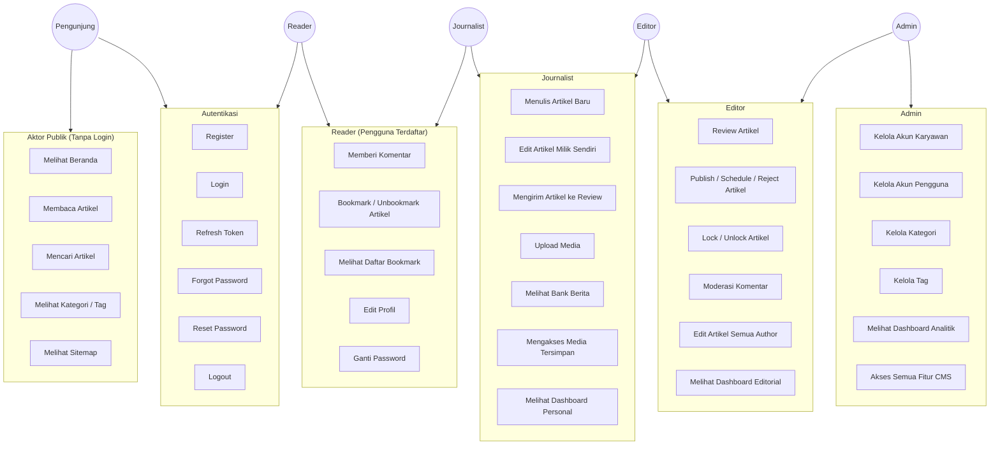

### Penjelasan Use Case

Diagram di atas menggambarkan 4 level aktor berdasarkan peran (role):

1. **Pengunjung (Public)** — dapat mengakses halaman beranda, membaca artikel, mencari artikel, melihat kategori/tag, dan melihat sitemap tanpa perlu login. Juga bisa register dan login.

2. **Reader** — pengguna terdaftar yang bisa memberi komentar pada artikel, menyimpan bookmark, melihat daftar bookmark, serta mengelola profil dan password pribadi.

3. **Journalist** — memiliki semua hak reader ditambah kemampuan menulis artikel baru (draft), mengedit artikel milik sendiri, mengirim artikel ke review, upload media, dan mengakses Bank Berita.

4. **Editor** — memiliki semua hak journalist ditambah kemampuan mereview artikel dari journalist manapun, mengubah status artikel (publish/schedule/reject), mengunci artikel agar tidak diedit bersamaan, dan memoderasi komentar.

5. **Admin** — memiliki akses penuh ke seluruh fitur CMS ditambah kemampuan mengelola akun karyawan dan pengguna, mengelola kategori dan tag, serta melihat dashboard analitik visitor.

---

## 3. Activity Diagram

### 3.1 Activity Diagram — Proses Login & Autentikasi

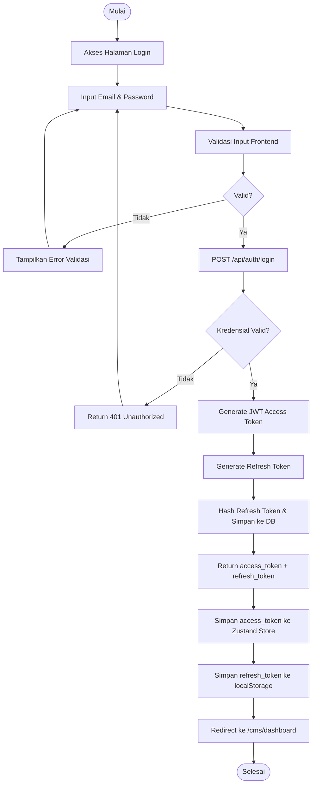

**Penjelasan:** Proses login dimulai dari validasi input di frontend (email dan password wajib diisi). Request dikirim ke endpoint `/api/auth/login`. Backend memverifikasi kredensial melalui `AuthService::login()`. Jika berhasil, JWT access token (umur pendek) dan refresh token (14 hari, di-hash SHA-256) dihasilkan. Access token disimpan di Zustand store (memory + persist), refresh token di localStorage. Axios interceptor akan otomatis menyertakan Bearer token pada setiap request berikutnya.

### 3.2 Activity Diagram — Silent Token Refresh

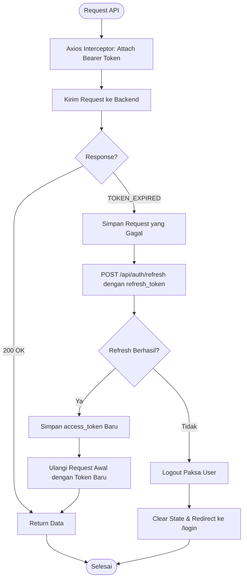

**Penjelasan:** Setiap request API melewati Axios interceptor yang menyertakan Bearer token. Jika backend mengembalikan error `TOKEN_EXPIRED`, interceptor secara otomatis melakukan silent refresh menggunakan refresh token dari localStorage. Jika refresh berhasil, request awal diulang dengan token baru tanpa interaksi user. Jika refresh gagal (token revoked/expired), user di-logout paksa dan diarahkan ke halaman login.

### 3.3 Activity Diagram — Alur Penulisan & Publikasi Artikel

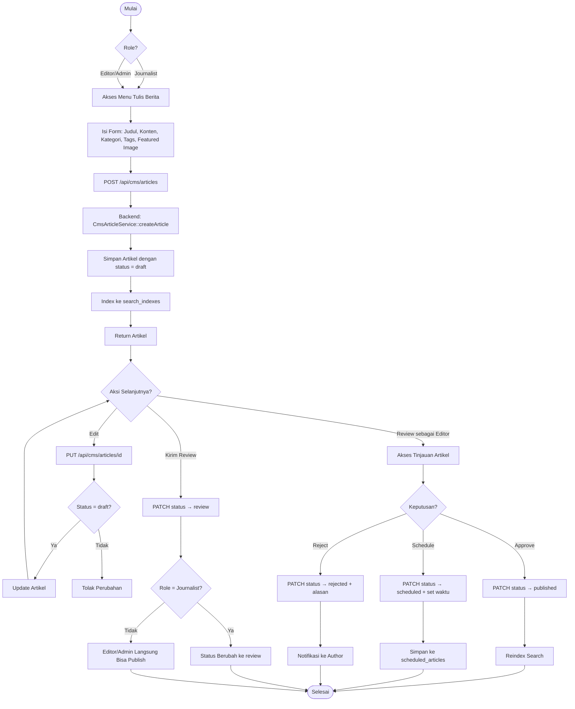

**Penjelasan:** Alur penulisan artikel dimulai dari form "Tulis Berita". Journalist dan editor/admin dapat membuat artikel baru yang otomatis berstatus `draft`. Setelah draft tersimpan, author dapat mengedit (selama masih draft) atau mengirim ke review. Editor/admin kemudian mereview melalui halaman "Tinjauan Artikel" dan dapat menyetujui (published), menjadwalkan (scheduled), atau menolak (rejected). Artikel yang di-publish akan di-index ulang di search_indexes. Artikel scheduled disimpan di tabel `scheduled_articles` dan akan otomatis terbit melalui cron job.

### 3.4 Activity Diagram — Moderasi Komentar

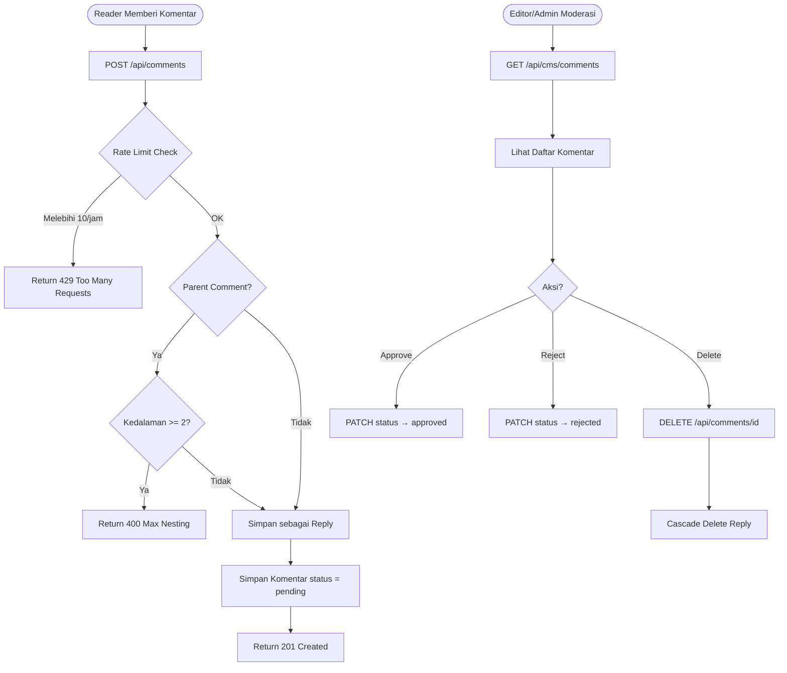

**Penjelasan:** Reader yang sudah login dapat memberi komentar. Sistem menerapkan rate limiting 10 komentar per jam per user menggunakan tabel `comment_rate_limits`. Komentar bisa bertingkat (threaded) maksimal 2 level. Setiap komentar baru berstatus `pending` dan perlu disetujui oleh editor/admin melalui CMS. Editor/admin juga dapat menghapus komentar beserta reply-nya (cascade delete).

### 3.5 Activity Diagram — Scheduled Publishing

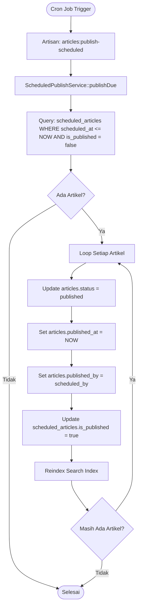

**Penjelasan:** Cron job menjalankan perintah Artisan `articles:publish-scheduled` secara berkala. `ScheduledPublishService` mencari semua artikel yang sudah melewati waktu terjadwal dan belum dipublikasi. Setiap artikel yang ditemukan akan diubah statusnya menjadi `published`, di-set waktu publish dan who-published-nya, kemudian search index-nya diperbarui.

---

## 4. Sequence Diagram

### 4.1 Sequence Diagram — Proses Login

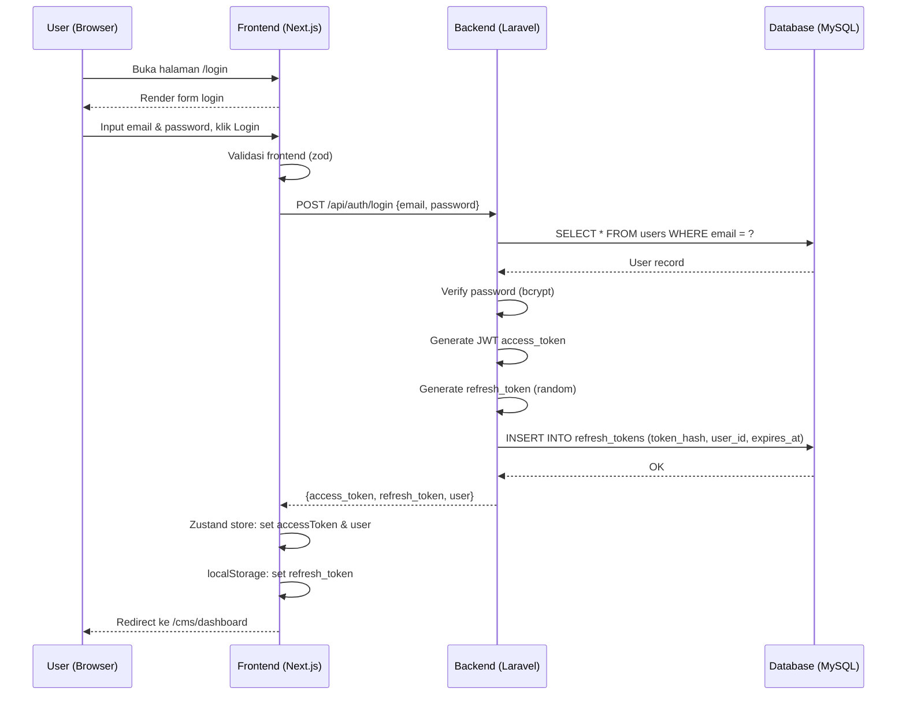

### 4.2 Sequence Diagram — Silent Token Refresh

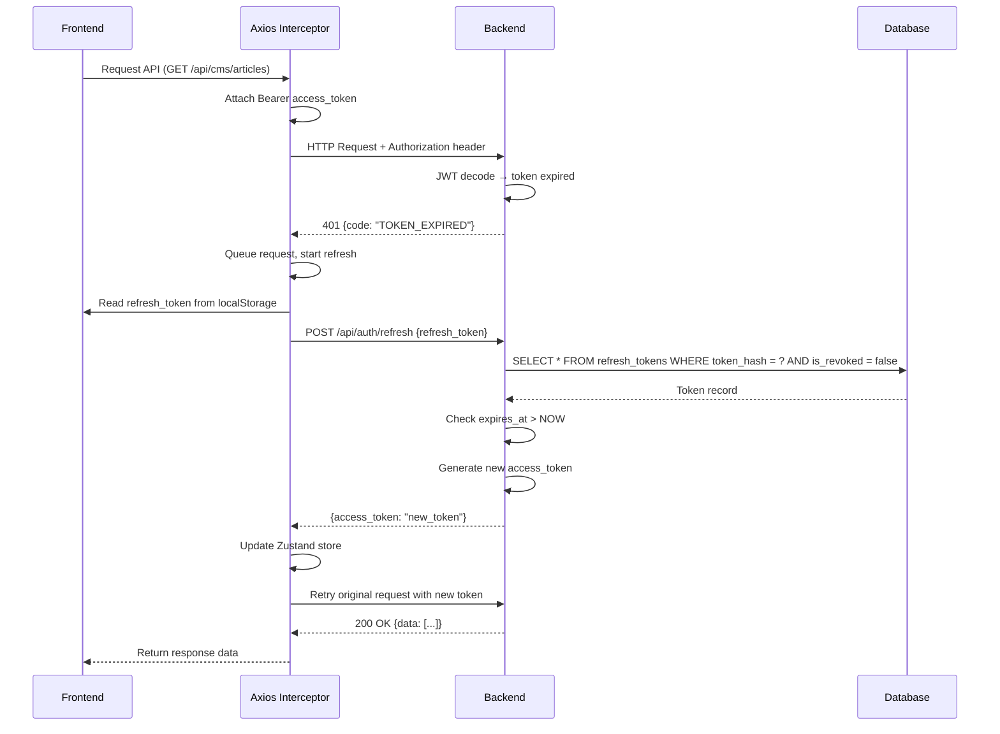

### 4.3 Sequence Diagram — CRUD Artikel CMS

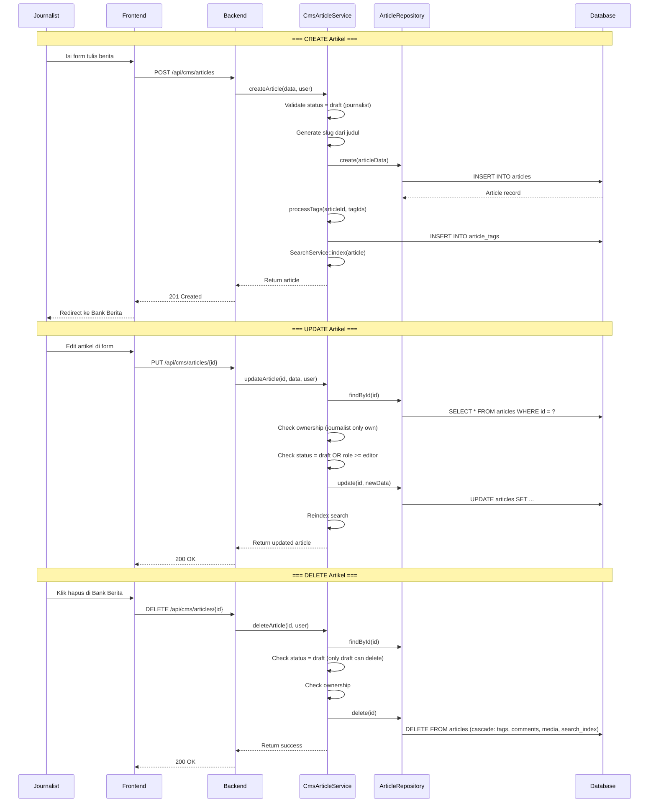

### 4.4 Sequence Diagram — Review & Publish Artikel

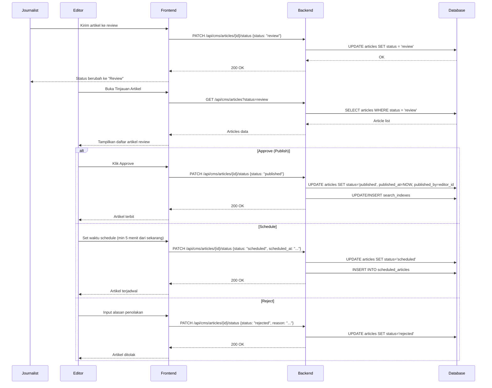

### 4.5 Sequence Diagram — Bookmark Artikel

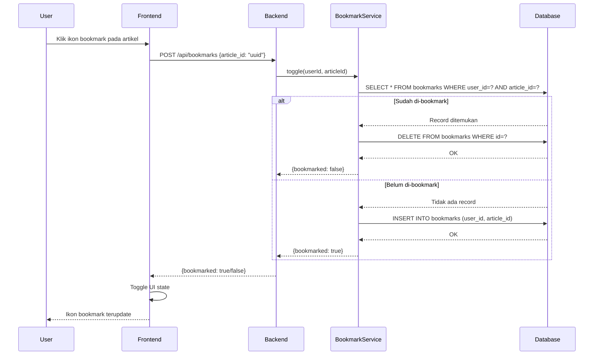

### 4.6 Sequence Diagram — Page View Analytics

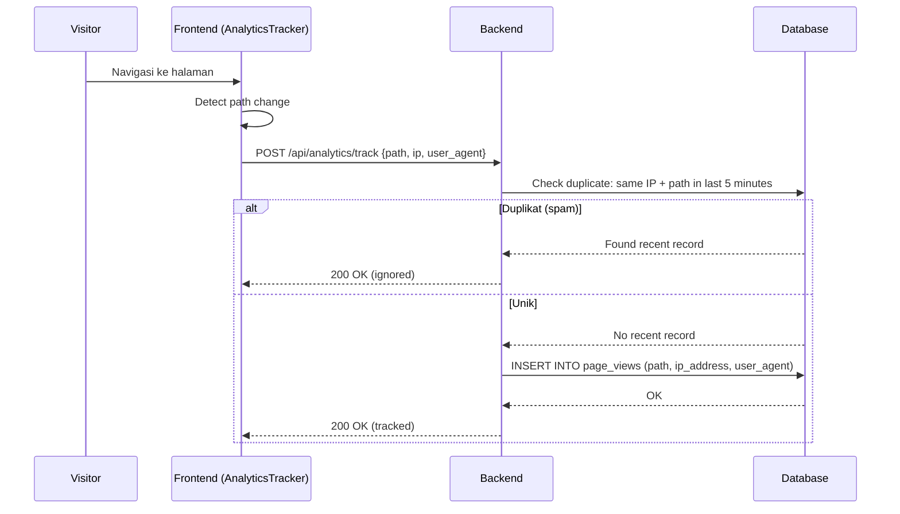


---

## 5. Class Diagram

### 5.1 Backend Architecture — Service-Repository Pattern

```mermaid
classDiagram
    direction TB

    class AuthController {
        +register(Request) JsonResponse
        +login(Request) JsonResponse
        +refresh(Request) JsonResponse
        +logout(Request) JsonResponse
        +me() JsonResponse
        +updateProfile(Request) JsonResponse
        +changePassword(Request) JsonResponse
        +forgotPassword(Request) JsonResponse
        +resetPassword(Request) JsonResponse
    }

    class CmsArticleController {
        +index(Request) JsonResponse
        +store(Request) JsonResponse
        +show(id) JsonResponse
        +update(Request, id) JsonResponse
        +destroy(id) JsonResponse
        +updateStatus(Request, id) JsonResponse
        +lock(id) JsonResponse
        +unlock(id) JsonResponse
    }

    class ArticleController {
        +index(Request) JsonResponse
        +show(slug) JsonResponse
        +comments(id) JsonResponse
        +sitemap() JsonResponse
        +newsSitemap() JsonResponse
    }

    class CommentController {
        +storeForArticle(Request, id) JsonResponse
        +store(Request) JsonResponse
        +destroy(id) JsonResponse
    }

    class BookmarkController {
        +index(Request) JsonResponse
        +toggle(Request) JsonResponse
    }

    class MediaController {
        +index(Request) JsonResponse
        +upload(Request) JsonResponse
        +destroy(id) JsonResponse
    }

    class UserController {
        +index(Request) JsonResponse
        +store(Request) JsonResponse
        +show(id) JsonResponse
        +update(Request, id) JsonResponse
        +destroy(id) JsonResponse
    }

    class CmsDashboardController {
        +index(Request) JsonResponse
    }

    class CmsCommentController {
        +index(Request) JsonResponse
    }

    class CmsCategoryController {
        +index() JsonResponse
        +store(Request) JsonResponse
        +update(Request, id) JsonResponse
        +destroy(id) JsonResponse
    }

    class AnalyticsController {
        +track(Request) JsonResponse
    }

    class BerandaController {
        +index() JsonResponse
    }

    class AuthService {
        -UserRepositoryInterface userRepo
        -RefreshTokenRepositoryInterface refreshRepo
        +register(array) array
        +login(array) array
        +refresh(string) array
        +logout(string) void
        +forgotPassword(string) void
        +resetPassword(array) void
    }

    class CmsArticleService {
        -ArticleRepositoryInterface articleRepo
        -SearchService searchService
        +getCmsArticles(Request, User) array
        +getCmsArticleById(id, User) Article
        +createArticle(array, User) Article
        +updateArticle(id, array, User) Article
        +updateStatus(id, array, User) Article
        +lockArticle(id, User) Article
        +unlockArticle(id, User) Article
        +deleteArticle(id, User) void
        +processTags(id, array) void
    }

    class ArticleService {
        -ArticleRepositoryInterface articleRepo
        +getPublishedArticles(Request) array
        +getArticleBySlug(string) Article
        +getArticleComments(id) array
    }

    class BerandaService {
        -BerandaRepositoryInterface berandaRepo
        +getBerandaData() array
    }

    class BookmarkService {
        +getBookmarks(userId) array
        +toggle(userId, articleId) array
    }

    class MediaService {
        -MediaRepositoryInterface mediaRepo
        +getMedia(Request) array
        +uploadMedia(Request, User) Media
        +deleteMedia(id) void
    }

    class SearchService {
        +index(Article) void
        +search(string) array
    }

    class ScheduledPublishService {
        +publishDue() int
    }

    class UserService {
        -UserRepositoryInterface userRepo
        +getUsers(Request) array
        +createUser(array) User
        +updateUser(id, array) User
        +deleteUser(id) void
    }

    class ArticleRepositoryInterface {
        <<interface>>
        +getAll(filters) array
        +findById(id) Article
        +create(data) Article
        +update(id, data) Article
        +delete(id) void
    }

    class UserRepositoryInterface {
        <<interface>>
        +findByEmail(email) User
        +findById(id) User
        +create(data) User
        +update(id, data) User
    }

    class RefreshTokenRepositoryInterface {
        <<interface>>
        +create(data) RefreshToken
        +findByHash(hash) RefreshToken
        +revokeAllForUser(userId) void
    }

    class BerandaRepositoryInterface {
        <<interface>>
        +getFeatured() array
        +getPopular() array
        +getLatest() array
        +getCategories() array
    }

    AuthController --> AuthService
    CmsArticleController --> CmsArticleService
    ArticleController --> ArticleService
    BerandaController --> BerandaService
    BookmarkController --> BookmarkService
    MediaController --> MediaService
    UserController --> UserService
    CmsDashboardController --> ArticleService

    AuthService --> UserRepositoryInterface
    AuthService --> RefreshTokenRepositoryInterface
    CmsArticleService --> ArticleRepositoryInterface
    ArticleService --> ArticleRepositoryInterface
    BerandaService --> BerandaRepositoryInterface
    UserService --> UserRepositoryInterface

    CmsArticleService --> SearchService
    ScheduledPublishService --> SearchService
```

### Penjelasan Class Diagram

Arsitektur backend mengikuti **Service-Repository Pattern**:

- **Controllers** (lapis terluar) — menerima HTTP request, melakukan validasi dasar, lalu mendelegasikan ke Service. Controller bersifat *thin* (sedikit logika bisnis).
- **Services** (lapis tengah) — berisi semua logika bisnis seperti validasi role, cek ownership, transisi status artikel, dan orkestrasi antar-repository.
- **Repositories** (lapis data) — menangani query database. Didefinisikan sebagai *interface* (`ArticleRepositoryInterface`, `UserRepositoryInterface`, dll.) yang di-bind ke implementasi konkret melalui `RepositoryServiceProvider`. Ini memungkinkan pertukaran sumber data (misal: DB ke JSON) tanpa mengubah Service atau Controller.

### 5.2 Frontend Architecture

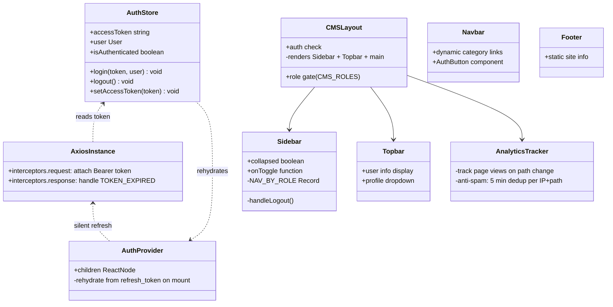

### Penjelasan Frontend Architecture

Frontend Next.js menggunakan **Zustand** sebagai state manager untuk autentikasi:

- **AuthStore** — menyimpan access token, data user, dan status autentikasi. Menggunakan `persist` middleware agar state tersimpan di localStorage.
- **Axios Instance** — custom Axios dengan 2 interceptor: request (attach Bearer token) dan response (silent refresh saat token expired).
- **AuthProvider** — komponen wrapper yang melakukan *silent rehydration* saat halaman pertama kali dimuat, menggunakan refresh token dari localStorage.
- **CMSLayout** — layout CMS yang melakukan pengecekan autentikasi dan role sebelum merender Sidebar + Topbar + konten halaman.
- **Sidebar** — navigasi CMS berbasis role (`NAV_BY_ROLE`), menampilkan menu berbeda untuk journalist, editor, dan admin.

---

## 6. Conceptual Data Model (CDM)

CDM menggambarkan entitas-entitas utama dalam sistem beserta hubungannya secara konseptual, tanpa detail kolom.

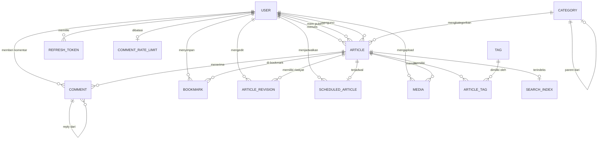

### Penjelasan Entitas CDM

| Entitas              | Deskripsi                                                                 |
|----------------------|---------------------------------------------------------------------------|
| **User**             | Semua pengguna sistem (reader, journalist, editor, admin)                 |
| **Article**          | Artikel berita dengan judul, konten, slug, status editorial               |
| **Category**         | Kategori artikel dengan struktur hierarki (parent-child self-reference)   |
| **Tag**              | Label/keyword yang bisa ditempel ke banyak artikel                        |
| **Article_Tag**      | Tabel junction many-to-many antara Article dan Tag                        |
| **Comment**          | Komentar pengguna pada artikel, mendukung threading (max 2 level)         |
| **Bookmark**         | Penanda artikel favorit oleh user (unique constraint: 1 user = 1 bookmark per artikel) |
| **Media**            | File media (image/video/audio) yang terikat ke artikel atau berdiri sendiri (library) |
| **RefreshToken**     | Token untuk memperbarui JWT access token, disimpan dalam bentuk hash      |
| **SearchIndex**      | Index pencarian full-text (gabungan judul + konten + tags), 1:1 dengan artikel |
| **ArticleRevision**  | Snapshot riwayat perubahan artikel                                        |
| **ScheduledArticle** | Jadwal penerbitan otomatis, 1:1 dengan artikel                            |
| **CommentRateLimit** | Pembatasan rate komentar per user (10/jam)                                |
| **PageView**         | Pencatatan kunjungan halaman untuk analitik                               |

### Relasi Utama

- **User → Article**: Satu user bisa menulis banyak artikel (author). User lain bisa mem-publish (published_by) atau mengunci (locked_by).
- **Category → Article**: Satu kategori memiliki banyak artikel, satu artikel hanya di satu kategori (nullable).
- **Article ↔ Tag**: Many-to-many melalui tabel junction `article_tags`.
- **Article → Comment**: Satu artikel memiliki banyak komentar. Komentar bisa memiliki reply (self-reference, max 2 level).
- **User → Bookmark → Article**: User bisa bookmark banyak artikel, tapi satu artikel hanya bisa di-bookmark sekali per user.
- **Article → SearchIndex**: One-to-one, setiap artikel punya satu index pencarian.
- **Article → ScheduledArticle**: One-to-one, artikel terjadwal punya satu record jadwal.
- **Category → Category**: Self-reference untuk hierarki kategori parent-child.

---

## 7. Physical Data Model (PDM)

PDM menggambarkan struktur tabel database secara detail termasuk tipe data, constraints, dan index.

### 7.1 Tabel `users`

| Kolom              | Tipe Data         | Constraint                     | Keterangan                    |
|--------------------|-------------------|--------------------------------|-------------------------------|
| `id`               | BIGINT UNSIGNED   | PK, AUTO_INCREMENT             | Primary key                   |
| `name`             | VARCHAR(255)      | NOT NULL                       | Nama lengkap                  |
| `email`            | VARCHAR(255)      | UNIQUE, NOT NULL               | Email untuk login             |
| `role`             | ENUM              | DEFAULT 'reader'               | admin/editor/journalist/reader|
| `is_active`        | BOOLEAN           | DEFAULT true                   | Status akun aktif             |
| `avatar_url`       | VARCHAR(255)      | NULLABLE                       | URL foto profil               |
| `bio`              | TEXT              | NULLABLE                       | Bio pengguna                  |
| `password`         | VARCHAR(255)      | NOT NULL                       | Hash bcrypt                   |
| `remember_token`   | VARCHAR(100)      | NULLABLE                       | Laravel remember token        |
| `email_verified_at`| TIMESTAMP         | NULLABLE                       | Verifikasi email              |
| `created_at`       | TIMESTAMP         |                                |                               |
| `updated_at`       | TIMESTAMP         |                                |                               |

### 7.2 Tabel `categories`

| Kolom      | Tipe Data   | Constraint                     | Keterangan                |
|------------|-------------|--------------------------------|---------------------------|
| `id`       | UUID        | PK                             | UUID primary key          |
| `parent_id`| UUID        | NULLABLE, FK→categories(id) ON DELETE SET NULL | Parent kategori (hierarki) |
| `name`     | VARCHAR(255)| NOT NULL                       | Nama kategori             |
| `slug`     | VARCHAR(255)| UNIQUE, NOT NULL               | URL slug                  |

### 7.3 Tabel `articles`

| Kolom                | Tipe Data         | Constraint                               | Keterangan                   |
|----------------------|-------------------|------------------------------------------|------------------------------|
| `id`                 | UUID              | PK                                       | UUID primary key             |
| `author_id`          | BIGINT UNSIGNED   | FK→users(id) ON DELETE CASCADE, NOT NULL | Penulis artikel              |
| `published_by`       | BIGINT UNSIGNED   | FK→users(id) ON DELETE SET NULL, NULLABLE| User yang mem-publish        |
| `locked_by`          | BIGINT UNSIGNED   | FK→users(id) ON DELETE SET NULL, NULLABLE| Editor yang mengunci         |
| `category_id`        | UUID              | FK→categories(id) ON DELETE RESTRICT, NULLABLE | Kategori artikel        |
| `title`              | VARCHAR(255)      | NOT NULL                                 | Judul artikel                |
| `slug`               | VARCHAR(255)      | UNIQUE, NOT NULL                         | URL slug                     |
| `excerpt`            | TEXT              | NULLABLE                                 | Ringkasan artikel            |
| `content`            | LONGTEXT          | NOT NULL                                 | Konten lengkap               |
| `featured_image_url` | VARCHAR(255)      | NULLABLE                                 | URL gambar utama             |
| `status`             | ENUM              | DEFAULT 'draft', INDEX                   | draft/review/scheduled/published/archived |
| `is_featured`        | BOOLEAN           | DEFAULT false, INDEX                     | Artikel unggulan             |
| `view_count`         | BIGINT UNSIGNED   | DEFAULT 0, INDEX                         | Jumlah view                  |
| `published_at`       | TIMESTAMP         | NULLABLE, INDEX                          | Waktu publikasi              |
| `created_at`         | TIMESTAMP         |                                          |                              |
| `updated_at`         | TIMESTAMP         |                                          |                              |

### 7.4 Tabel `tags`

| Kolom  | Tipe Data    | Constraint         | Keterangan       |
|--------|-------------|--------------------|------------------|
| `id`   | UUID        | PK                 | UUID primary key |
| `name` | VARCHAR(255)| UNIQUE, NOT NULL   | Nama tag         |
| `slug` | VARCHAR(255)| UNIQUE, NOT NULL   | URL slug         |

### 7.5 Tabel `article_tags` (Junction)

| Kolom        | Tipe Data        | Constraint                         | Keterangan       |
|--------------|-----------------|-------------------------------------|------------------|
| `article_id` | UUID            | FK→articles(id) ON DELETE CASCADE  | Composite PK     |
| `tag_id`     | UUID            | FK→tags(id) ON DELETE CASCADE      | Composite PK     |

### 7.6 Tabel `comments`

| Kolom        | Tipe Data        | Constraint                                | Keterangan           |
|--------------|-----------------|-------------------------------------------|----------------------|
| `id`         | UUID            | PK                                        | UUID primary key     |
| `article_id` | UUID            | FK→articles(id) ON DELETE CASCADE         | Artikel terkait      |
| `user_id`    | BIGINT UNSIGNED | FK→users(id) ON DELETE CASCADE            | Pembuat komentar     |
| `parent_id`  | UUID            | FK→comments(id) ON DELETE CASCADE, NULLABLE | Reply dari komentar |
| `content`    | TEXT            | NOT NULL                                  | Isi komentar         |
| `status`     | ENUM            | DEFAULT 'pending'                         | pending/approved/rejected |
| `created_at` | TIMESTAMP       | DEFAULT CURRENT_TIMESTAMP                 |                      |
| **Index**    |                 | INDEX (article_id, status)                |                      |

### 7.7 Tabel `media`

| Kolom           | Tipe Data        | Constraint                                | Keterangan              |
|-----------------|-----------------|-------------------------------------------|-------------------------|
| `id`            | UUID            | PK                                        | UUID primary key        |
| `article_id`    | UUID            | FK→articles(id) ON DELETE SET NULL, NULLABLE | Artikel terkait (nullable = library) |
| `uploaded_by`   | BIGINT UNSIGNED | FK→users(id) ON DELETE SET NULL, NULLABLE | User yang upload        |
| `file_url`      | VARCHAR(255)    | NOT NULL                                  | URL file                |
| `media_type`    | ENUM            | NOT NULL                                  | image/video/audio       |
| `alt_text`      | VARCHAR(255)    | NULLABLE                                  | Teks alternatif         |
| `category_name` | VARCHAR(255)    | NULLABLE                                  | Kategori media          |
| `is_library`    | BOOLEAN         | DEFAULT false                             | true = Media Tersimpan global |
| `created_at`    | TIMESTAMP       | DEFAULT CURRENT_TIMESTAMP                 |                         |

### 7.8 Tabel `bookmarks`

| Kolom        | Tipe Data        | Constraint                          | Keterangan               |
|--------------|-----------------|-------------------------------------|--------------------------|
| `id`         | UUID            | PK                                  | UUID primary key         |
| `user_id`    | BIGINT UNSIGNED | FK→users(id) ON DELETE CASCADE      | User yang bookmark       |
| `article_id` | UUID            | NOT NULL (FK dropped)               | ID artikel               |
| `created_at` | TIMESTAMP       | DEFAULT CURRENT_TIMESTAMP           |                          |
| **Unique**   |                 | UNIQUE (user_id, article_id)        | 1 bookmark per user per artikel |

### 7.9 Tabel `refresh_tokens`

| Kolom        | Tipe Data        | Constraint                          | Keterangan                |
|--------------|-----------------|-------------------------------------|---------------------------|
| `id`         | UUID            | PK                                  | UUID primary key          |
| `user_id`    | BIGINT UNSIGNED | FK→users(id) ON DELETE CASCADE      | Pemilik token             |
| `token_hash` | VARCHAR(255)    | NOT NULL                            | Hash SHA-256 dari token   |
| `device_info`| VARCHAR(255)    | NULLABLE                            | Info perangkat            |
| `ip_address` | VARCHAR(45)     | NULLABLE                            | Alamat IP                 |
| `is_revoked` | BOOLEAN         | DEFAULT false                       | Status dicabut            |
| `expires_at` | TIMESTAMP       | NOT NULL, INDEX                     | Waktu kedaluwarsa         |
| `created_at` | TIMESTAMP       | DEFAULT CURRENT_TIMESTAMP           |                           |
| **Index**    |                 | INDEX (user_id, is_revoked)         |                           |

### 7.10 Tabel `search_indexes`

| Kolom          | Tipe Data | Constraint                       | Keterangan                         |
|----------------|----------|----------------------------------|------------------------------------|
| `id`           | UUID     | PK                               | UUID primary key                   |
| `article_id`   | UUID     | UNIQUE, FK→articles(id) CASCADE  | 1 artikel = 1 index               |
| `search_vector`| TEXT     | FULLTEXT INDEX                   | Gabungan judul + konten + tags     |
| `tags_cache`   | TEXT     | NULLABLE                         | Nama-nama tag dalam satu string    |
| `updated_at`   | TIMESTAMP| DEFAULT CURRENT_TIMESTAMP ON UPDATE |                                |

### 7.11 Tabel `article_revisions`

| Kolom              | Tipe Data        | Constraint                          | Keterangan              |
|--------------------|-----------------|-------------------------------------|-------------------------|
| `id`               | UUID            | PK                                  | UUID primary key        |
| `article_id`       | UUID            | FK→articles(id) ON DELETE CASCADE   | Artikel terkait         |
| `edited_by`        | BIGINT UNSIGNED | FK→users(id) ON DELETE RESTRICT     | User yang mengedit      |
| `title_snapshot`   | VARCHAR(255)    | NOT NULL                            | Snapshot judul          |
| `content_snapshot` | LONGTEXT        | NOT NULL                            | Snapshot konten         |
| `change_note`      | VARCHAR(255)    | NULLABLE                            | Catatan perubahan       |
| `created_at`       | TIMESTAMP       | DEFAULT CURRENT_TIMESTAMP           |                         |

### 7.12 Tabel `scheduled_articles`

| Kolom          | Tipe Data        | Constraint                                | Keterangan                |
|----------------|-----------------|-------------------------------------------|---------------------------|
| `id`           | UUID            | PK                                        | UUID primary key          |
| `article_id`   | UUID            | UNIQUE, FK→articles(id) ON DELETE CASCADE | 1 artikel = 1 jadwal     |
| `scheduled_by` | BIGINT UNSIGNED | FK→users(id) ON DELETE RESTRICT           | User yang menjadwalkan    |
| `scheduled_at` | TIMESTAMP       | NOT NULL                                  | Waktu terbit terjadwal    |
| `is_published` | BOOLEAN         | DEFAULT false                             | Sudah terbit atau belum   |
| `created_at`   | TIMESTAMP       | DEFAULT CURRENT_TIMESTAMP                 |                           |
| **Index**      |                 | INDEX (is_published, scheduled_at)        |                           |

### 7.13 Tabel `comment_rate_limits`

| Kolom          | Tipe Data        | Constraint                          | Keterangan                  |
|----------------|-----------------|-------------------------------------|-----------------------------|
| `id`           | UUID            | PK                                  | UUID primary key            |
| `user_id`      | BIGINT UNSIGNED | UNIQUE, FK→users(id) ON DELETE CASCADE | 1 record per user       |
| `comment_count`| INT UNSIGNED    | DEFAULT 0                           | Jumlah komentar di window   |
| `window_start` | TIMESTAMP       | DEFAULT CURRENT_TIMESTAMP           | Awal window rate limit      |
| `is_blocked`   | BOOLEAN         | DEFAULT false                       | Status diblokir             |
| `blocked_until`| TIMESTAMP       | NULLABLE                            | Waktu buka blokir           |
| **Index**      |                 | INDEX (user_id, is_blocked)         |                             |

### 7.14 Tabel `page_views`

| Kolom        | Tipe Data    | Constraint      | Keterangan              |
|--------------|-------------|-----------------|-------------------------|
| `id`         | BIGINT      | PK, AUTO_INCREMENT | Primary key          |
| `path`       | VARCHAR(255)| INDEX, NOT NULL | Path URL yang dikunjungi|
| `ip_address` | VARCHAR(45) | NULLABLE        | Alamat IP visitor       |
| `user_agent` | TEXT        | NULLABLE        | User agent browser      |
| `created_at` | TIMESTAMP   |                 |                         |
| `updated_at` | TIMESTAMP   |                 |                         |

---

## 8. Penjelasan Detail

### 8.1 Alur Autentikasi Lengkap

Sistem autentikasi menggunakan **JWT (JSON Web Token)** dengan dua jenis token:

1. **Access Token** — umur pendek (dari config JWT), dikirim sebagai Bearer token di header `Authorization`. Digunakan untuk mengakses semua endpoint terproteksi.

2. **Refresh Token** — umur 14 hari, disimpan sebagai hash SHA-256 di tabel `refresh_tokens`. Disimpan di `localStorage` browser dan hanya dikirim saat endpoint `/api/auth/refresh`.

**Siklus Token:**
```
Login → access_token + refresh_token
      → access_token expired → silent refresh via refresh_token → new access_token
      → refresh_token expired/revoke → force logout → re-login
```

**Keamanan:**
- Refresh token di-hash (SHA-256) sebelum disimpan di DB — jika DB bocor, token asli tidak bisa direkonstruksi.
- Saat reset password, semua refresh token user di-revoke (semua sesi berakhir).
- Endpoint forgot password menggunakan pola anti user-enumeration (response sama untuk email terdaftar/tidak).

### 8.2 Editorial Workflow (Alur Redaksi)

Alur editorial mengimplementasikan **state machine** sederhana:

```
     ┌──────────┐
     │  DRAFT   │ ← Journalist membuat artikel
     └────┬─────┘
          │ kirim review
          ▼
     ┌──────────┐
     │  REVIEW  │ ← Editor melihat di Tinjauan Artikel
     └────┬─────┘
          │
     ┌────┼────────────┐
     ▼    ▼            ▼
┌─────────┐ ┌──────────┐ ┌──────────┐
│PUBLISHED│ │SCHEDULED │ │REJECTED  │
└────┬────┘ └────┬─────┘ └──────────┘
     │           │ cron job
     │           ▼
     │      ┌──────────┐
     │      │PUBLISHED │
     │      └──────────┘
     ▼
┌──────────┐
│ ARCHIVED │
└──────────┘
```

**Aturan transisi status:**
- `draft` → `review` : oleh journalist/editor/admin
- `review` → `published` / `scheduled` / `rejected` : oleh editor/admin
- `scheduled` → `published` : otomatis oleh cron job
- `published` → `archived` : oleh editor/admin (satu arah, tidak bisa kembali)

**Validasi:**
- Scheduled publish minimal 5 menit dari waktu sekarang.
- Journalist hanya bisa edit artikel miliknya sendiri yang masih draft.
- Editor bisa lock artikel untuk mencegah editing bersamaan.

### 8.3 Article Locking Mechanism

Fitur ini mencegah konflik editing saat beberapa editor bekerja:

1. Editor mengklik "Lock" → `articles.locked_by = editor_id`
2. Editor lain yang mencoba edit akan melihat artikel terkunci
3. Editor yang sama bisa "Unlock" → `articles.locked_by = NULL`
4. Lock otomatis terlepas jika editor ter-logout (nullOnDelete)

### 8.4 Pencarian Full-Text

Pencarian menggunakan **MySQL FULLTEXT** pada tabel `search_indexes`:

- `search_vector` = gabungan judul + konten (strip HTML) + nama-nama tag
- Di-index ulang setiap kali artikel dibuat, diupdate, atau dipublish
- Query menggunakan `MATCH(search_vector) AGAINST('keyword')` untuk ranking relevansi
- Command `php artisan articles:reindex` untuk rebuild seluruh index

### 8.5 SEO & Sitemap

- **XML Sitemap** — `/articles/sitemap` menghasilkan sitemap standar semua artikel published
- **News Sitemap** — `/articles/news-sitemap` menghasilkan sitemap khusus Google News (hanya artikel 48 jam terakhir)
- **JSON-LD** — structured data Article di setiap halaman artikel
- **Open Graph & Twitter Cards** — meta tag untuk social sharing
- **robots.ts** — konfigurasi crawler

### 8.6 Dashboard Analitik

Dashboard menampilkan statistik berbeda berdasarkan role:

**Admin:**
- Total artikel, komentar, bookmark (dengan filter waktu: hari ini, 7 hari, 30 hari, 1 tahun)
- Sparkline grafik tren harian dari tabel `page_views`
- Distribusi artikel per kategori
- Top artikel berdasarkan view count

**Editor/Journalist:**
- Statistik personal: total artikel, draft, published, archived
- Grafik distribusi status artikel (Recharts BarChart & PieChart)

### 8.7 API Endpoints Ringkasan

| Group        | Method | Endpoint                              | Auth   | Role           | Fungsi                    |
|-------------|--------|---------------------------------------|--------|----------------|---------------------------|
| Auth        | POST   | `/api/auth/register`                  | -      | Public         | Registrasi user baru      |
| Auth        | POST   | `/api/auth/login`                     | -      | Public         | Login                     |
| Auth        | POST   | `/api/auth/refresh`                   | -      | Public         | Refresh access token      |
| Auth        | POST   | `/api/auth/logout`                    | JWT    | Any            | Logout + revoke token     |
| Auth        | GET    | `/api/auth/me`                        | JWT    | Any            | Data user saat ini        |
| Auth        | PUT    | `/api/auth/profile`                   | JWT    | Any            | Update profil             |
| Auth        | PUT    | `/api/auth/change-password`           | JWT    | Any            | Ganti password            |
| Auth        | POST   | `/api/auth/forgot-password`           | -      | Public         | Request reset password    |
| Auth        | POST   | `/api/auth/reset-password`            | -      | Public         | Reset password dengan token |
| Public      | GET    | `/api/beranda`                        | -      | Public         | Data halaman beranda      |
| Public      | GET    | `/api/categories`                     | -      | Public         | Daftar kategori           |
| Public      | GET    | `/api/tags`                           | -      | Public         | Daftar tag                |
| Public      | GET    | `/api/articles`                       | -      | Public         | Artikel published (paginated) |
| Public      | GET    | `/api/articles/{slug}`                | -      | Public         | Detail artikel            |
| Public      | GET    | `/api/articles/{id}/comments`         | -      | Public         | Komentar artikel          |
| Public      | GET    | `/api/articles/sitemap`               | -      | Public         | XML Sitemap               |
| Public      | GET    | `/api/articles/news-sitemap`          | -      | Public         | News Sitemap              |
| Analytics   | POST   | `/api/analytics/track`                | -      | Public         | Track page view           |
| Bookmark    | GET    | `/api/bookmarks`                      | JWT    | Any            | Daftar bookmark           |
| Bookmark    | POST   | `/api/bookmarks`                      | JWT    | Any            | Toggle bookmark           |
| Comment     | POST   | `/api/articles/{id}/comments`         | JWT    | Any (rate limit)| Buat komentar            |
| Comment     | DELETE | `/api/comments/{id}`                  | JWT    | Editor/Admin   | Hapus komentar            |
| Media       | GET    | `/api/media`                          | JWT    | CMS roles      | Daftar media              |
| Media       | POST   | `/api/media/upload`                   | JWT    | CMS roles      | Upload media              |
| Media       | DELETE | `/api/media/{id}`                     | JWT    | CMS roles      | Hapus media               |
| CMS Article | GET    | `/api/cms/articles`                   | JWT    | CMS roles      | Daftar artikel CMS        |
| CMS Article | POST   | `/api/cms/articles`                   | JWT    | CMS roles      | Buat artikel baru         |
| CMS Article | GET    | `/api/cms/articles/{id}`              | JWT    | CMS roles      | Detail artikel CMS        |
| CMS Article | PUT    | `/api/cms/articles/{id}`              | JWT    | CMS roles      | Update artikel            |
| CMS Article | DELETE | `/api/cms/articles/{id}`              | JWT    | CMS roles      | Hapus artikel (draft only)|
| CMS Article | PATCH  | `/api/cms/articles/{id}/status`       | JWT    | Editor/Admin   | Ubah status artikel       |
| CMS Article | POST   | `/api/cms/articles/{id}/lock`         | JWT    | Editor/Admin   | Kunci artikel             |
| CMS Article | POST   | `/api/cms/articles/{id}/unlock`       | JWT    | Editor/Admin   | Buka kunci artikel        |
| CMS Comment | GET    | `/api/cms/comments`                   | JWT    | Editor/Admin   | Daftar komentar moderasi  |
| CMS Stats   | GET    | `/api/cms/statistics`                 | JWT    | CMS roles      | Dashboard statistics      |
| CMS Category| CRUD   | `/api/cms/categories`                 | JWT    | Admin          | Kelola kategori           |
| CMS Tag     | CRUD   | `/api/cms/tags`                       | JWT    | Admin          | Kelola tag                |
| User        | CRUD   | `/api/users`                          | JWT+admin | Admin       | Kelola user               |

### 8.8 Konvensi Penamaan & Standar Kode

- **Primary Key**: UUID untuk tabel bisnis (articles, categories, tags, comments, media, dll), AUTO_INCREMENT BIGINT untuk tabel sistem (users, page_views)
- **Foreign Key**: Selalu menggunakan constraint dengan policy yang sesuai (CASCADE untuk child yang harus ikut terhapus, SET NULL untuk relasi opsional, RESTRICT untuk mencegah hapus jika masih direferensi)
- **Naming**: snake_case untuk kolom dan tabel, camelCase untuk method dan properti di PHP/JavaScript
- **API Response**: Format konsisten `{success: boolean, data?: any, message?: string, errors?: object}`
- **Error Code**: `TOKEN_EXPIRED` untuk JWT expired, HTTP 401/403/404/422 untuk standar

### 8.9 Struktur Folder Frontend

```
frontend/
├── app/
│   ├── (main)/           # Layout publik (Navbar + Footer)
│   │   ├── page.tsx      # Halaman utama (/)
│   │   └── ...
│   ├── cms/              # Layout CMS (Sidebar + Topbar)
│   │   ├── layout.tsx    # Auth guard + role check
│   │   ├── dashboard/    # Dashboard statistik
│   │   ├── artikel/      # Bank Berita (list + detail + preview)
│   │   ├── tulis-berita/ # Form tulis artikel baru
│   │   ├── tinjauan-artikel/ # Review artikel (editor)
│   │   ├── media/        # Media Tersimpan
│   │   ├── komentar/     # Moderasi komentar
│   │   ├── karyawan/     # Kelola karyawan (admin)
│   │   ├── pengguna/     # Kelola pengguna (admin)
│   │   ├── kategori/     # Kelola kategori & tag (admin)
│   │   ├── profil/       # Profil user
│   │   └── reset-password/
│   ├── components/       # Komponen reusable
│   │   ├── cms/          # Sidebar, Topbar, AdminDashboard
│   │   ├── navbar.tsx
│   │   ├── footer.tsx
│   │   ├── AuthProvider.tsx
│   │   └── AnalyticsTracker.tsx
│   ├── constants/        # Konstanta (roles, config)
│   ├── types/            # TypeScript type definitions
│   ├── login/            # Halaman login
│   ├── register/         # Halaman register
│   ├── pages/            # Halaman publik (beranda, about, contact)
│   └── layout.tsx        # Root layout
├── lib/
│   ├── api/              # API client functions
│   ├── axios.ts          # Axios instance + interceptors
│   ├── auth.ts           # Auth helpers (localStorage)
│   └── validations.ts    # Zod validation schemas
└── stores/
    └── authStore.ts      # Zustand auth store
```
